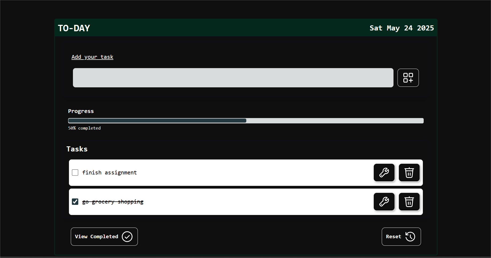

# ToDay
A simple to-do web app that tracks your progress.



## Getting Started

To use the app, visit: [ToDay](https://to-day-progress.netlify.app/)

## Development

* Clone the repo:
```bash
$ git clone https://github.com/aayushiie/to-day.git
```

* Go to project directory and install dependencies
```bash
$ cd to-day && npm install
```

* To run the app on local host
```bash
$ npm run dev
```
